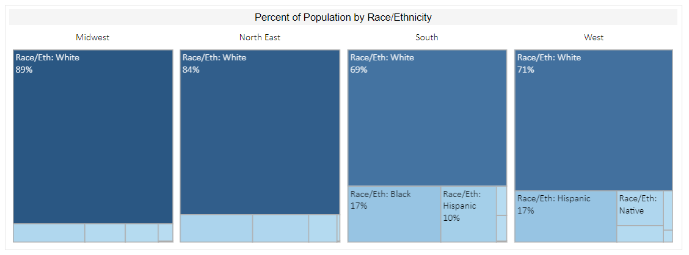
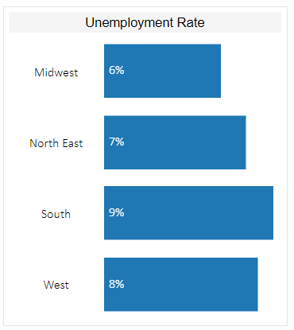
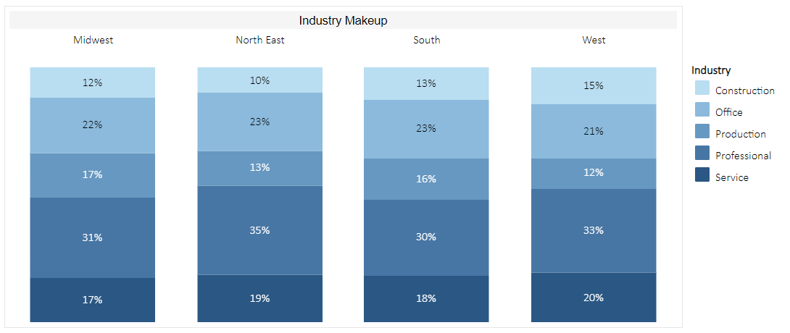
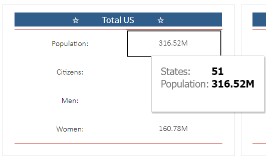
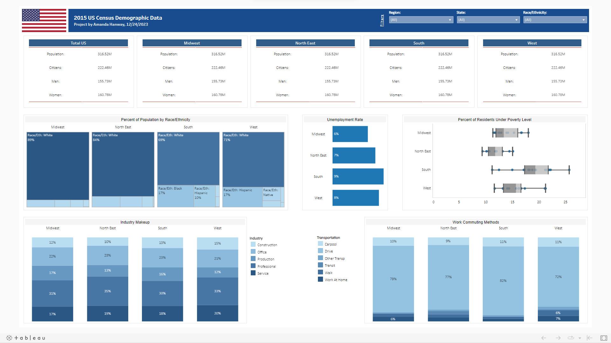

# Udacity Data Analyst Nanodegree - Data Visualization  Project: US Census Demographic Data
### By: Amanda Hanway, 12/25/2023  
  
## Overview  

In this project, I developed a Tableau dashboard to analyze 2015 US Census Demographic Data. The data was provided in csv format and required no preprocessing steps before loading it into Tableau. This project was focused on creating visuals to convey insights from the data.  

- Data source: [acs2015_county_data.csv](https://www.kaggle.com/datasets/muonneutrino/us-census-demographic-data?resource=download&select=acs2015_county_data.csv)  
- View the Dashboard: [Tableau Public](https://public.tableau.com/app/profile/amanda.hanway/viz/2015USDemographics/Dashboard)  

Note:   
- The analysis below is reflective of all US states including Alaska and Hawaii, but excluding Puerto Rico. I chose to exclude Puerto Rico because it is not considered part of the four regions of the US by the US Census.  
  
## Written Summary

### Visual 1
- Description:
  - This visual is a treemap chart displaying the percent of population by region broken out by race/ethnicity. It will allow the reader to gain insight into the race/ethnicity makeup for each region in the US.
- Story:
  - The White race/ethnicity is the most prevelant among all regions in the US.
  - The Midwest has the greatest proportion of White individuals while the South has the least when compared to the other regions.
  - The West has the largest percent of Hispanic individuals out of the entire US.  
- Design:
  -  I chose to use a treemap chart to display this data because it allowed me to show proportions of race/ethnicity makeup for each region. I used the blue color scheme for this report to align the visuals with the subject of US Demographics. 
- Resources: N/A
  

### Visual 2
- Description:
  - This visual is a bar chart displaying the unemployment rate by region. It will allow the reader to understand the unemployment rate in each region of the US.
- Story:
  - The South had the greatest unemployment rate in the US in 2015.
  - The Midwest had the lowest unemployment rate out of all regions.
  - The North East came in 2nd lowest followed by the West in 3rd.  
- Design:
  -  I chose to use a bar chart to display this data because it allowed me to compare the unemployment rates by region. I sorted the chart by the rates in ascending order so that the reader can clearly tell which regions were lowest vs highest. I used the blue color scheme to stay consistent with the overall theme of the report.
- Resources: N/A
  

### Visual 3
- Description:
  - This visual is a 100% stacked column chart displaying the proportion of industry makeup by region. Using this visual, the reader can understand which industries are more or less prevelant in each region.
- Story:
  - The West region has the largest proportion of the Service and Construction industries in the US.  
  - The North East region is made up of a greater percentage of Professional industry work than the other regions.
  - The Midwest industries are more Production-focused but less Service-focused than the other regions.
- Design:
  -  I chose to use a 100% stacked bar chart to display this data because it allowed me to show proportions of the industry makeup by type, for all regions individually. I used the blue color scheme to stay consistent with the overall theme of the report.
- Resources: N/A
  

### Visual 3
- Description:
  - This visual is a card displaying summary statistics for the total US. 
- Story:
  - The US population was 316.52M in the 2015 census.
  - 222.46M of the US population were citizens.
  - There were more women than men.
- Design:
  -  I chose to use a card to display this data because it is a space-effective way to show important and useful information. I used the red/white/blue color scheme to stay consistent with the overall theme of the report. I included an additional tooltip in this visual showing the total count of states. 
- Resources: N/A
 
  
### Dashboard:  
  

  
 
 
 
 
 
 
